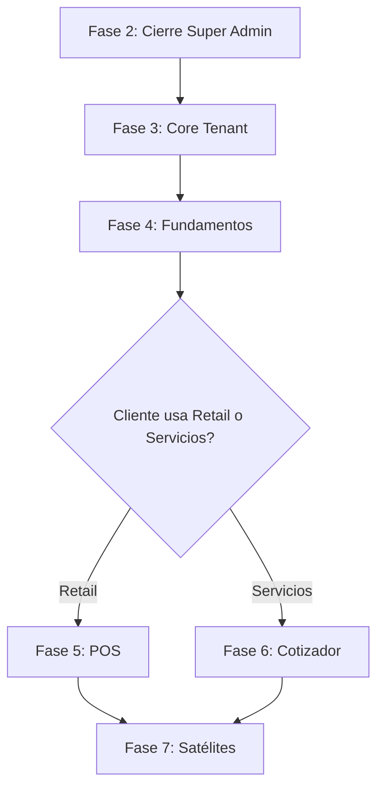

# Plan de Desarrollo: Tendo Business Operating System

> **Fecha:** 12 de Febrero de 2026  
> **Versión:** 1.0  
> **Estado Actual:** Fase 1.6 Completada (Super Admin Core)

---

## 🔄 Actualización Ejecutiva (16 de Febrero de 2026)

Este documento mantiene el historial original de planificación, pero su estado actual fue superado por la implementación reciente.

### Estado real vigente

- ✅ **Core Tenant** operativo: autenticación, onboarding, settings y team.
- ✅ **Track Retail MVP** operativo: productos, POS, caja, dashboard KPI, fiados/créditos/pagos.
- ✅ **Track Servicios MVP** operativo: cotizaciones, conversión a proyecto, ejecución con gastos/recursos/hitos, desvío por hito y alertas.
- 🟡 **Super Admin** funcional para administración base (tenants/usuarios/membresías/logs), con brecha en analítica avanzada de negocio SaaS.

### Prioridades vigentes (siguiente iteración)

1. **Release readiness**: checklist Go-Live, respaldo, monitoreo y operación.
2. **Backoffice Super Admin**: métricas globales SaaS y panel de operación.
3. **Satélites financieros**: consolidar flujo explícito de cuentas por pagar/proveedores.
4. **Hardening funcional**: permisos finos por rol interno y reportes operativos.

📋 Referencia operativa: `docs/GO-LIVE-CHECKLIST.md`

---

## 🎯 Objetivos Estratégicos

1. **Completar Backoffice Super Admin** (Gestión del SaaS)
2. **Implementar Core Tenant** (Dashboard operativo + Configuración)
3. **Preparar Arquitectura Modular** (Activación de Tracks Retail/Servicios)
4. **Establecer Fundamentos de Negocio** (Clientes, Productos, Documentos)

---

## 📊 Estado Actual del Proyecto

### ✅ Completado

#### Fase 1.5-1.6: Infraestructura Super Admin
- ✅ Autenticación Auth.js v5 con extensión `isSuperAdmin`
- ✅ Multi-tenancy (Organization, Member, User)
- ✅ CRUD de Tenants (crear, editar, eliminar, asignar owners)
- ✅ CRUD de Usuarios (editar, promover super admin, gestionar membresías)
- ✅ Sistema de Audit Logs (registro de cambios)
- ✅ Gestión de Membresías (agregar/remover usuarios de orgs)
- ✅ Feature Flags básicos (array `modules` en Organization)
- ✅ Toast notifications (Sonner)
- ✅ Componentes UI (19 de Shadcn/ui)

### 🔄 Parcial

- 🟡 Dashboard Super Admin (placeholder estático)
- 🟡 Gestión de Planes (solo campo `plan` string)
- 🟡 Dashboard Tenant (KPIs hardcodeados)

### ❌ No Iniciado

#### Super Admin
- ❌ Métricas globales (MRR, Churn, Growth)
- ❌ Gestión de suscripciones/billing detallado
- ❌ Soporte/Impersonation (acceder como tenant)
- ❌ Logs de actividad de tenants

#### Tenant Core
- ❌ Configuración de empresa (logo, RUT, dirección)
- ❌ Sistema de roles internos (OWNER, ADMIN, MEMBER with permissions)
- ❌ Gestión de usuarios internos (invitar, activar/desactivar)
- ❌ Dashboard con KPIs reales (ventas, utilidad, cuentas por cobrar)

#### Módulos de Negocio
- ❌ Catálogo de Productos/Servicios
- ❌ Base de Clientes (CRM light)
- ❌ Documentos comerciales (modelo base polimórfico)
- ❌ Sistema de inventario
- ❌ Punto de Venta (POS)
- ❌ Cotizador

---

## 🗺️ Roadmap de Desarrollo

### FASE 2: Cierre de Super Admin
**Duración estimada:** 2-3 sesiones  
**Objetivo:** Completar herramientas internas de administración del SaaS

#### 2.1 Dashboard Super Admin con Métricas Reales
**Archivos:** `app/admin/page.tsx`, `app/api/admin/metrics/route.ts`

**Métricas a implementar:**
```typescript
interface SuperAdminMetrics {
  // Tenants
  totalTenants: number
  activeTenants: number       // status: ACTIVE
  trialTenants: number        // status: TRIAL
  suspendedTenants: number    // status: SUSPENDED
  newTenantsThisMonth: number
  
  // Usuarios
  totalUsers: number
  usersWithoutOrganization: number  // problema de datos
  activeUsersThisWeek: number       // con sessions recientes
  
  // Revenue (futuro con Stripe)
  mrr: number                 // Monthly Recurring Revenue
  arr: number                 // Annual Recurring Revenue
  churnRate: number           // % tenants cancelados
  
  // Actividad
  recentActivity: AuditLog[]  // últimas 10 acciones
  topOrganizationsByUsers: { name: string, userCount: number }[]
}
```

**Componentes:**
- `MetricCard` (reutilizable)
- `ActivityFeed` (últimas acciones de audit log)
- `TenantStatusChart` (gráfico de distribución)
- `GrowthChart` (tenants nuevos por mes)

**Prioridad:** 🟡 Media (nice to have, no crítico para MVP)

---

#### 2.2 Gestión de Suscripciones/Planes
**Archivos:** `app/admin/subscriptions/`, `prisma/schema.prisma`

**Schema updates:**
```prisma
enum SubscriptionStatus {
  ACTIVE
  PAST_DUE      // Moroso
  CANCELED
  TRIALING
}

model Subscription {
  id             String              @id @default(cuid())
  organizationId String              @unique @map("organization_id")
  plan           String              // "BASIC", "PRO", "ENTERPRISE"
  status         SubscriptionStatus  @default(TRIALING)
  currentPeriodStart DateTime        @map("current_period_start")
  currentPeriodEnd   DateTime        @map("current_period_end")
  cancelAtPeriodEnd  Boolean         @default(false) @map("cancel_at_period_end")
  
  // Stripe (futuro)
  stripeCustomerId       String?     @map("stripe_customer_id")
  stripeSubscriptionId   String?     @map("stripe_subscription_id")
  
  createdAt DateTime @default(now()) @map("created_at")
  updatedAt DateTime @updatedAt @map("updated_at")
  
  organization Organization @relation(fields: [organizationId], references: [id], onDelete: Cascade)
  
  @@map("subscriptions")
}
```

**Features:**
- Ver estado de suscripción por tenant
- Cambiar plan manualmente (upgrade/downgrade)
- Extender período de trial
- Marcar como moroso (suspender acceso)
- Historial de cambios de plan

**Prioridad:** 🟡 Media (importante pero no bloqueante para MVP)

---

#### 2.3 Soporte/Impersonation
**Archivos:** `app/admin/tenants/_components/impersonate-button.tsx`, `app/api/admin/impersonate/route.ts`

**Funcionalidad:**
```typescript
// Desde admin panel, clic en tenant → "Acceder como Admin"
// 1. Verificar isSuperAdmin = true
// 2. Crear session temporal con:
//    - user = primer OWNER del tenant
//    - currentOrganizationId = tenant.id
//    - metadata: { impersonatedBy: superAdminId }
// 3. Redirect a /dashboard
// 4. Banner persistente: "Estás en modo soporte. Salir"
```

**Seguridad:**
- Audit log de todas las acciones en modo impersonation
- Timeout automático (30 min)
- No puede promover super admins
- No puede eliminar tenants

**Prioridad:** 🟢 Alta (crítico para dar soporte a clientes)

---

### FASE 3: Core Tenant (Dashboard Operativo)
**Duración estimada:** 3-4 sesiones  
**Objetivo:** Permitir que los clientes usen el sistema para su negocio real

#### 3.1 Configuración de Empresa
**Archivos:** `app/(dashboard)/settings/`, `app/api/settings/`

**Modelo de datos:**
```prisma
model OrganizationSettings {
  id             String   @id @default(cuid())
  organizationId String   @unique @map("organization_id")
  
  // Identidad
  businessName   String   @map("business_name")  // Razón social
  tradeName      String?  @map("trade_name")     // Nombre de fantasía
  rut            String   @unique
  logoUrl        String?  @map("logo_url")
  
  // Ubicación
  address        String?
  city           String?
  region         String?
  country        String   @default("Chile")
  
  // Contacto
  phone          String?
  email          String?
  website        String?
  
  // Fiscales
  taxRegime      String?  @map("tax_regime")    // "Régimen Simplificado", "Renta Efectiva"
  economicActivity String? @map("economic_activity")
  
  // Regional
  timezone       String   @default("America/Santiago")
  currency       String   @default("CLP")
  locale         String   @default("es-CL")
  
  createdAt DateTime @default(now()) @map("created_at")
  updatedAt DateTime @updatedAt @map("updated_at")
  
  organization Organization @relation(fields: [organizationId], references: [id], onDelete: Cascade)
  
  @@map("organization_settings")
}
```

**Páginas:**
```
/dashboard/settings
  /settings/general       → Logo, nombre, RUT
  /settings/location      → Dirección, región
  /settings/users         → Gestión de usuarios del tenant
  /settings/modules       → Ver módulos activos (read-only)
  /settings/billing       → Plan actual, historial de pagos
```

**Features MVP:**
- Upload de logo (Uploadthing o Cloudinary)
- Validación de RUT chileno
- Formulario de datos fiscales
- Preview de cómo se verá en documentos

**Prioridad:** 🔴 Crítica (bloqueante para usar el sistema)

---

#### 3.2 Gestión de Usuarios Internos
**Archivos:** `app/(dashboard)/settings/users/`, `app/api/tenant/users/`

**Sistema de Permisos:**
```typescript
enum TenantRole {
  OWNER      // Acceso total, puede eliminar org
  ADMIN      // Acceso a configuración, no puede eliminar org
  MANAGER    // Acceso a reportes y supervisión
  SELLER     // Solo vender, no ve costos
  VIEWER     // Solo lectura
}

// Permisos por módulo
interface ModulePermissions {
  pos: boolean          // Puede usar Punto de Venta
  inventory: boolean    // Puede editar inventario
  quotes: boolean       // Puede crear cotizaciones
  reports: boolean      // Puede ver reportes financieros
  customers: boolean    // Puede gestionar clientes
  settings: boolean     // Puede cambiar configuración
}
```

**Actualizar schema Member:**
```prisma
model Member {
  id             String     @id @default(cuid())
  userId         String     @map("user_id")
  organizationId String     @map("organization_id")
  role           MemberRole @default(MEMBER)
  
  // Nuevos campos
  isActive       Boolean    @default(true) @map("is_active")
  permissions    Json?      // ModulePermissions flexibles
  
  createdAt      DateTime   @default(now()) @map("created_at")
  updatedAt      DateTime   @updatedAt @map("updated_at")
  
  user         User         @relation(...)
  organization Organization @relation(...)
  
  @@unique([userId, organizationId])
  @@map("members")
}
```

**Features:**
- Invitar usuarios por email
- Activar/desactivar sin eliminar
- Asignar roles con permisos granulares
- Ver actividad por usuario (audit log filtrado)

**Prioridad:** 🟡 Media (importante para equipos, no para solopreneurs)

---

#### 3.3 Dashboard Operativo con KPIs Reales
**Archivos:** `app/(dashboard)/dashboard/page.tsx`, `app/api/dashboard/kpis/route.ts`

**KPIs a implementar (depende de módulos activos):**

```typescript
interface TenantDashboardKPIs {
  // Ventas (requiere módulo POS o Documents)
  salesToday: number           // CLP
  salesThisWeek: number
  salesThisMonth: number
  salesGrowth: number          // % vs mes anterior
  
  // Utilidad (requiere módulo Finanzas)
  grossProfit: number          // Ventas - Costo de Ventas
  netProfit: number            // Gross - Gastos Operacionales
  profitMargin: number         // %
  
  // Inventario (requiere módulo Inventory)
  productCount: number
  lowStockProducts: number     // Alertas
  inventoryValue: number       // Valor total del stock
  
  // Clientes (requiere módulo CRM)
  totalCustomers: number
  newCustomersThisMonth: number
  accountsReceivable: number   // Total por cobrar
  overdueInvoices: number      // Facturas vencidas
  
  // Proyectos (requiere módulo Services)
  activeProjects: number
  quotesThisMonth: number
  conversionRate: number       // Cotizaciones → Proyectos
}
```

**Componentes dinámicos según módulos:**
```tsx
// Dashboard se adapta a módulos activos
{hasModule('POS') && <SalesOverviewCard />}
{hasModule('INVENTORY') && <StockAlertsCard />}
{hasModule('SERVICES') && <ProjectsStatusCard />}
{hasModule('FINANCE') && <CashFlowCard />}
```

**Gráficos:**
- Ventas diarias (últimos 30 días) - Line chart
- Top productos vendidos - Bar chart
- Distribución de clientes por estado - Pie chart
- Estado de cotizaciones - Kanban visual

**Prioridad:** 🔴 Crítica (es la home del tenant)

---

### FASE 4: Fundamentos de Negocio
**Duración estimada:** 4-5 sesiones  
**Objetivo:** Implementar modelos base para tracks Retail y Servicios

#### 4.1 Catálogo de Productos y Servicios
**Archivos:** `app/(dashboard)/catalog/`, `prisma/schema.prisma`

**Modelo polimórfico:**
```prisma
enum ProductType {
  PRODUCT   // Tangible, maneja stock
  SERVICE   // Intangible, no tiene stock
}

model Product {
  id             String      @id @default(cuid())
  organizationId String      @map("organization_id")
  
  // Básicos
  type           ProductType
  sku            String      // Único por organización
  name           String
  description    String?     @db.Text
  imageUrl       String?     @map("image_url")
  
  // Pricing
  price          Decimal     @db.Decimal(10, 2)  // Precio de venta
  cost           Decimal?    @db.Decimal(10, 2)  // Costo (no visible para vendedores)
  taxRate        Decimal     @default(19) @db.Decimal(5, 2)  // IVA Chile
  
  // Inventario (solo PRODUCT)
  trackInventory Boolean     @default(false) @map("track_inventory")
  currentStock   Int?        @map("current_stock")
  minStock       Int?        @map("min_stock")  // Alerta de reposición
  unit           String?     // "UN", "KG", "LT"
  
  // Servicios (solo SERVICE)
  durationMinutes Int?       @map("duration_minutes")  // Para agendamiento
  
  // Control
  isActive       Boolean     @default(true) @map("is_active")
  categoryId     String?     @map("category_id")
  
  createdAt DateTime @default(now()) @map("created_at")
  updatedAt DateTime @updatedAt @map("updated_at")
  
  organization Organization @relation(...)
  category     Category?    @relation(...)
  
  @@unique([organizationId, sku])
  @@index([organizationId, type])
  @@index([organizationId, isActive])
  @@map("products")
}

model Category {
  id             String   @id @default(cuid())
  organizationId String   @map("organization_id")
  name           String
  description    String?
  
  products Product[]
  
  @@unique([organizationId, name])
  @@map("categories")
}
```

**Features:**
- Importar CSV de productos (bulk upload)
- Búsqueda por SKU/nombre
- Filtros por categoría, tipo, stock
- Alertas de stock bajo
- Vista de cards/tabla toggle
- Generar código de barras automático

**Prioridad:** 🔴 Crítica (base para POS y Cotizador)

---

#### 4.2 Base de Clientes (CRM Light)
**Archivos:** `app/(dashboard)/customers/`, `prisma/schema.prisma`

```prisma
enum CustomerType {
  INDIVIDUAL
  BUSINESS
}

model Customer {
  id             String       @id @default(cuid())
  organizationId String       @map("organization_id")
  
  // Identidad
  type           CustomerType @default(INDIVIDUAL)
  name           String       // Nombre completo o Razón Social
  rut            String?      // RUT o DNI
  email          String?
  phone          String?
  
  // Dirección
  address        String?
  city           String?
  region         String?
  
  // Comercial
  creditLimit    Decimal?     @db.Decimal(10, 2) @map("credit_limit")
  balance        Decimal      @default(0) @db.Decimal(10, 2)  // Saldo por cobrar
  
  // Metadata
  notes          String?      @db.Text
  tags           String[]     @default([])  // "VIP", "Moroso"
  isActive       Boolean      @default(true) @map("is_active")
  
  createdAt DateTime @default(now()) @map("created_at")
  updatedAt DateTime @updatedAt @map("updated_at")
  
  organization Organization @relation(...)
  documents    Document[]
  
  @@unique([organizationId, rut])
  @@index([organizationId, isActive])
  @@map("customers")
}
```

**Features:**
- CRUD de clientes
- Ver historial de compras/cotizaciones
- Calcular saldo automáticamente
- Enviar recordatorio de pago (futuro)
- Exportar a Excel

**Prioridad:** 🔴 Crítica (necesario para documentos)

---

#### 4.3 Sistema de Documentos Polimórfico
**Archivos:** `prisma/schema.prisma`

**Modelo base flexible para Ventas, Cotizaciones, Órdenes:**
```prisma
enum DocumentType {
  SALE          // Boleta/Factura (Retail)
  QUOTE         // Cotización (Servicios)
  INVOICE       // Factura formal
  PURCHASE      // Orden de compra a proveedor
}

enum DocumentStatus {
  DRAFT         // Borrador
  PENDING       // Enviado al cliente
  APPROVED      // Aprobado (solo quotes)
  PAID          // Pagado
  PARTIALLY_PAID
  OVERDUE       // Vencido
  CANCELED
  CONVERTED     // Quote → Sale/Invoice
}

model Document {
  id             String         @id @default(cuid())
  organizationId String         @map("organization_id")
  
  // Tipo y estado
  type           DocumentType
  status         DocumentStatus @default(DRAFT)
  number         String         // Auto-generado: "V-00001", "C-00123"
  
  // Relaciones
  customerId     String?        @map("customer_id")
  issuedBy       String         @map("issued_by")  // userId del vendedor
  
  // Montos
  subtotal       Decimal        @db.Decimal(10, 2)
  tax            Decimal        @db.Decimal(10, 2)  // IVA
  discount       Decimal        @default(0) @db.Decimal(10, 2)
  total          Decimal        @db.Decimal(10, 2)
  
  // Pagos
  paidAmount     Decimal        @default(0) @db.Decimal(10, 2) @map("paid_amount")
  
  // Fechas
  issuedAt       DateTime       @map("issued_at")
  dueAt          DateTime?      @map("due_at")      // Para facturas/quotes
  paidAt         DateTime?      @map("paid_at")
  
  // Metadata
  notes          String?        @db.Text
  termsConditions String?       @db.Text @map("terms_conditions")
  
  // Conversión (Quote → Invoice)
  convertedFrom  String?        @map("converted_from")  // documentId original
  convertedTo    String?        @map("converted_to")
  
  createdAt DateTime @default(now()) @map("created_at")
  updatedAt DateTime @updatedAt @map("updated_at")
  
  organization Organization @relation(...)
  customer     Customer?    @relation(...)
  issuer       User         @relation(...)
  items        DocumentItem[]
  payments     Payment[]
  
  @@unique([organizationId, number])
  @@index([organizationId, type, status])
  @@index([customerId])
  @@map("documents")
}

model DocumentItem {
  id         String  @id @default(cuid())
  documentId String  @map("document_id")
  productId  String? @map("product_id")  // Null para items custom
  
  // Copia de datos del producto (snapshot)
  description String
  quantity    Decimal @db.Decimal(10, 3)
  unitPrice   Decimal @db.Decimal(10, 2) @map("unit_price")
  discount    Decimal @default(0) @db.Decimal(10, 2)
  subtotal    Decimal @db.Decimal(10, 2)
  
  document Document @relation(...)
  product  Product? @relation(...)
  
  @@map("document_items")
}

model Payment {
  id         String   @id @default(cuid())
  documentId String   @map("document_id")
  
  amount     Decimal  @db.Decimal(10, 2)
  method     String   // "CASH", "CARD", "TRANSFER", "CHECK"
  reference  String?  // N° de transacción
  paidAt     DateTime @map("paid_at")
  
  document Document @relation(...)
  
  @@map("payments")
}
```

**Prioridad:** 🔴 Crítica (corazón del sistema)

---

### FASE 5: Track Retail (POS)
**Duración estimada:** 5-6 sesiones  
**Objetivo:** Permitir vender productos físicos con control de stock

#### 5.1 Punto de Venta (POS)
- Interfaz de venta rápida (buscar producto, agregar al carrito)
- Scanner de código de barras
- Cálculo de vuelto
- Múltiples métodos de pago
- Imprimir boleta (PDF)
- Descuento por ítem o total
- Modo offline (LocalStorage → sync)

#### 5.2 Cierre de Caja
- Arqueo de efectivo
- Reporte de ventas del día
- Conciliación de pagos (efectivo vs tarjeta)

**Prioridad:** 🟢 Alta (MVP para retail)

---

### FASE 6: Track Servicios (Cotizador)
**Duración estimada:** 4-5 sesiones  
**Objetivo:** Crear presupuestos profesionales

#### 6.1 Cotizador
- Editor de cotizaciones con ítems de servicio + materiales
- Cálculo automático de márgenes
- Generación de PDF profesional
- Envío por email
- Conversión Quote → Invoice/Project

#### 6.2 Gestión de Proyectos
- Transformar cotización aprobada en proyecto
- Control de gastos vs presupuesto
- Estados de avance

**Prioridad:** 🟢 Alta (MVP para servicios)

---

### FASE 7: Módulos Satélite
**Duración estimada:** 6-8 sesiones  
**Objetivo:** Funciones de soporte transversal

#### 7.1 Mi Caja (Finanzas)
- Registro de gastos operacionales
- Categorías de gastos
- Flujo de caja proyectado

#### 7.2 Fiados (Cuentas por Cobrar)
- Ver clientes con saldo pendiente
- Recordatorios automáticos
- Registro de abonos parciales

#### 7.3 Por Pagar (Proveedores)
- Facturas pendientes
- Calendario de pagos

**Prioridad:** 🟡 Media (nice to have post-MVP)

---

## 🏗️ Estrategia de Implementación

### Orden Recomendado de Ejecución



### Priorización por Criticidad

#### 🔴 CRÍTICAS (MVP Bloqueantes)
1. **Fase 3.1:** Configuración de Empresa
2. **Fase 3.3:** Dashboard Operativo
3. **Fase 4.1:** Catálogo de Productos
4. **Fase 4.2:** Base de Clientes
5. **Fase 4.3:** Sistema de Documentos

#### 🟢 ALTAS (MVP Deseables)
6. **Fase 2.3:** Impersonation (soporte)
7. **Fase 5.1:** POS Retail
8. **Fase 6.1:** Cotizador Servicios

#### 🟡 MEDIAS (Post-MVP)
9. **Fase 2.1:** Dashboard Super Admin
10. **Fase 2.2:** Gestión de Suscripciones
11. **Fase 3.2:** Usuarios Internos
12. **Fase 7:** Módulos Satélite

---

## 📋 Siguiente Sesión: Fase 3.1 - Configuración de Empresa

### Tareas Concretas

1. **Migración de Prisma:**
   - Crear modelo `OrganizationSettings`
   - Ejecutar `npx prisma migrate dev --name add_organization_settings`

2. **API Endpoints:**
   - `GET /api/settings` - Obtener configuración
   - `PATCH /api/settings` - Actualizar configuración
   - `POST /api/settings/logo` - Upload de logo

3. **UI Components:**
   - Página `/dashboard/settings`
   - Formularios: General, Ubicación, Fiscal
   - Preview de logo con crop
   - Validador de RUT chileno

4. **Middleware:**
   - Verificar que usuario pertenece a organización
   - Extraer `organizationId` desde session

5. **Testing:**
   - Crear configuración inicial al crear tenant
   - Editar y verificar persistencia
   - Upload de logo (mock con placeholder)

### Checklist de Validación
- [ ] Schema migrado sin errores
- [ ] Settings page renderiza correctamente
- [ ] Formulario valida RUT chileno
- [ ] Logo se sube y se muestra en preview
- [ ] Cambios se guardan y persisten
- [ ] Audit log registra modificaciones
- [ ] Mobile responsive

---

## 🎯 Meta del Proyecto

### MVP Funcional (Fase 3-4 completas)
**Permite que un cliente nuevo pueda:**
1. Registrarse (Owner recibe invitación)
2. Configurar su empresa (logo, RUT, datos)
3. Agregar productos/servicios a catálogo
4. Registrar clientes
5. Ver dashboard con métricas básicas

### Producto Completo (Fase 5-6 completas)
**Permite que un negocio reemplace:**
- Excel de inventario → Catálogo + Stock
- Cuaderno de fiados → CRM + Cuentas por Cobrar
- Calculadora de venta → POS Retail
- Word de cotizaciones → Cotizador Profesional

---

## 📚 Documentación Técnica Generada

- ✅ `PROYECT_CONTEXT.md` - Visión y arquitectura
- ✅ `FASE-1.6-IMPLEMENTACION.md` - Super admin completado
- ✅ `ERRORES-RESUELTOS.md` - Debugging de fase 1.6
- 📝 `PLAN-DE-DESARROLLO.md` - Este documento

### Documentos Pendientes
- [ ] `API-REFERENCE.md` - Endpoints documentados
- [ ] `PERMISSIONS-MATRIX.md` - Roles y permisos
- [ ] `DATABASE-SCHEMA.md` - ERD completo
- [ ] `DEPLOYMENT-GUIDE.md` - Producción

---

## 🚀 Comandos Útiles

```bash
# Desarrollo
npm run dev                    # Servidor local
npx prisma studio              # DB GUI
npx prisma migrate dev         # Crear migración
npx prisma generate            # Regenerar cliente

# Testing
npm run build                  # Verificar errores de TS
curl localhost:3000/api/health # Health check

# Debugging
tail -f .next/trace             # Logs de compilación
npx prisma db push --skip-generate  # Sync schema sin migración
```

---

**Próxima acción recomendada:**  
Comenzar con **Fase 3.1: Configuración de Empresa** para permitir que los tenants personalicen su instancia del sistema.

¿Procedemos con la implementación?
